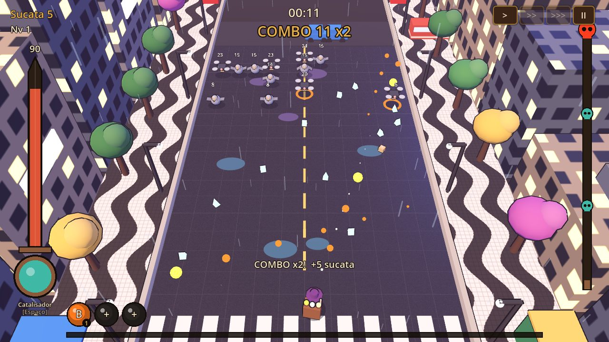

# Grota Funda (projeto Ball x Brasil)

> **Premissa:** a bola sagrada da vila caiu na Grota Funda, uma fenda encantada que atravessa os biomas do Brasil. Primeiro bioma: **Mata Atlântica**, com a **Mula sem Cabeça**. São Paulo segue como fase bônus.

> **Quebre. Ricocheteie. Evolua. Conquiste o Brasil.**
> Roguelite brasileiro de ação, física e construção de builds — Breakout + Roguelite + Survivors, num Brasil fantástico em miniatura (2.5D).



## Estado atual — protótipo v0.1 (vertical slice São Paulo)

Uma run completa, jogável do início ao fim, no navegador:

- **3 personagens** com passiva e habilidade: Guardião, Caçadora, Alquimista
- **23 bolas + 9 receitas** do catálogo brasileiro (Onça-Pintada, Pipoca, Saci, Pororoca, Cristo Redentor, Caipirinha…), **15 passivas**, **7 relíquias**, 5 raridades, 3 slots
- **6 reações elementais** (Vapor, Plasma, Neurotóxica, Sobrecarga, Combustão, Cristal tóxico)
- **Avenida Paulista** em diorama 2.5D: chuva, neon, ipês, MASP, trânsito que bloqueia bolas
- **5 inimigos** (Pombo Mecânico, Drone de Entrega, Robô Zona Azul, Fusca Corrompido, Golem de Concreto) + elites
- **Feira da Paulista** (evento de relíquias) e o chefe **O Arranha-Céu** (pontos fracos nas janelas, 2 fases)
- Combos (x2 → x3 → x4 → Frenesi), XP, level up "escolha 1 de 3", rerrolagem
- **Acampamento** com progressão permanente: Oficina, Laboratório, Arsenal, Relicário, Registros e mapa do Brasil
- Funciona em teclado + mouse e em toque (retrato/paisagem)

Mecânica central (bolsa limitada, matar no peito, tabelinha): ver [checklist Grota Funda](docs/GDD-18-mecanica-central-checklist.md).

Documentação de design em [`docs/`](docs): [GDD geral](docs/GDD-01-geral.md) · [Direção de arte 2.5D](docs/GDD-13-direcao-artistica-2.5D.md) · [Arquitetura](docs/GDD-15-arquitetura-tecnica.md) · [Catálogo de assets](docs/ASSETS.md) · [Roadmap](docs/ROADMAP.md) · [Referências visuais](docs/referencias).

## Rodando localmente

1. Instale o **Godot 4.3** (versão padrão, não precisa da .NET).
2. Abra `project.godot` no editor e aperte **F5**.

Linha de comando:

```bash
godot --path .                                   # joga
godot --headless --fixed-fps 60 -- --autotest cacadora 420   # IA joga uma run inteira e imprime o resultado
```

### Controles

| Ação | Teclado/mouse | Toque |
|---|---|---|
| Mover (X e Y na faixa de defesa) | `WASD` / setas · clique e segure | joystick virtual no lado **esquerdo** da tela |
| Ligar/desligar chute | `Q` | botão "Chute" |
| Mirar | mouse (`T` liga a mira automática) | joystick virtual no lado **direito** (soltou → mira automática) |
| Habilidade | `Espaço` / botão direito | — |
| Escolher upgrade | `1` `2` `3` `4` / clique | tocar na carta |
| Velocidade | `Tab` / botões `> >> >>>` | botões |
| Pausa | `Esc` / `P` | botão `II` |

### Atalhos de teste (versão web)

`/play/?teste=chefe&personagem=guardiao` · `/play/?teste=nivel` · `/play/?teste=feira`

## Arquitetura em 30 segundos

- **2.5D visualmente, 2D mecanicamente.** Toda a física é própria, em `Vector2`, com *substeps*; os nós 3D só espelham a posição.
- **Orientado a dados.** Bolas, inimigos, passivas, relíquias, personagens e regiões estão em [`data/*.json`](data). Novo conteúdo = novo JSON.
- **Visual procedural por enquanto.** Modelos de primitivas com contorno de nanquim (`scripts/visual/`). A troca por `.glb` está descrita em [ASSETS.md](docs/ASSETS.md).

```
scripts/run/run.gd        loop da run: física, dano, elementos, reações, XP, combo, chefe
scripts/run/run_build.gd  slots, passivas, relíquias, stats, ofertas de level up
scripts/autoload/         GameData (JSON + controles) e Save (progressão)
scripts/ui/               HUD, level up, menu, acampamento, resultados
site/                     landing page; o jogo exportado vai para site/play
```

## Deploy na Vercel

O jogo é exportado pelo Godot para HTML5/WebAssembly (sem threads, roda em qualquer host estático). O CI (`.github/workflows/web.yml`) faz tudo:

1. A cada push: baixa Godot 4.3, **roda uma run automática com cada personagem** (falha se houver erro de script) e exporta para `site/play/`.
2. Em push na `main`: publica a pasta `site/` (landing + jogo) na branch **`deploy-web`**.

**Configuração única na Vercel:**

1. *Add New → Project* → importe `victormartinsilva/brasilxball`.
2. *Framework Preset*: **Other** · *Build Command*: vazio · *Output Directory*: `.` (raiz).
3. Em *Settings → Git*, defina **Production Branch = `deploy-web`**.

Pronto: cada merge na `main` vira um deploy. (Alternativa: crie os secrets `VERCEL_TOKEN`, `VERCEL_ORG_ID` e `VERCEL_PROJECT_ID` no GitHub e o workflow também publica direto pela CLI da Vercel.)

Para testar o build web localmente:

```bash
godot --headless --export-release "Web" build/web/index.html
cd build/web && python3 -m http.server 8000   # abra http://localhost:8000
```

## Versionamento

- `main`: versão estável (deploy automático).
- Branches de feature → Pull Request → CI verde → merge.
- Commits pequenos e descritivos, em português.
