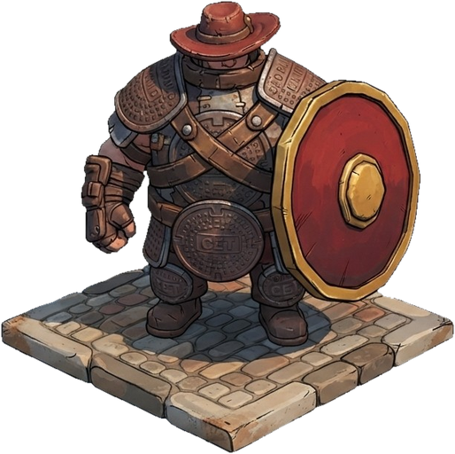
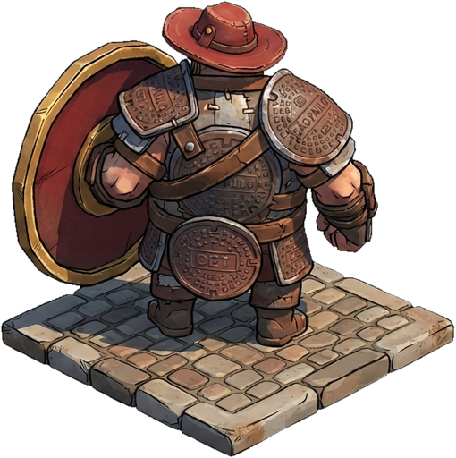

# O Guardião — ficha de personagem

 

> **Primeiro personagem do jogo.** Arte-fonte: [`assets/conceitos/guardiao_frente.jpg`](../../assets/conceitos/guardiao_frente.jpg) e [`guardiao_costas.jpg`](../../assets/conceitos/guardiao_costas.jpg).

## Conceito

Um grandalhão gentil que montou a própria armadura com **tampas de bueiro** arrancadas da cidade quando as assombrações começaram a subir pelos esgotos da Paulista. Não é soldado nem herói de capa: é o vizinho forte que segura a porta enquanto os outros correm. Onde ele pisa, a rua para de tremer.

- **Frase:** "Daqui não passa. Nem bola, nem assombração."
- **Função no time:** linha de frente — poucas bolas, muito dano, aguenta pancada.
- **Leitura em 1 segundo:** silhueta larga e baixa + escudo vermelho redondo + chapéu de aba vermelho.

## Silhueta e proporções

| Elemento | Regra |
|---|---|
| Corpo | 2,5 cabeças de altura; tronco ocupa 60% — "barril" |
| Cabeça | pequena, quase escondida entre as ombreiras e o chapéu |
| Braços | grossos; manopla de couro na mão livre |
| Escudo | redondo, **maior que o tronco**, sempre no braço esquerdo |
| Chapéu | aba larga vermelha (assinatura do elenco) |
| Postura | pés afastados, peso para baixo; nunca na ponta dos pés |

## Materiais

| Peça | Material | Detalhe |
|---|---|---|
| Ombreiras, peitoral, fivela do cinto, joelheiras | tampas de bueiro de ferro fundido | grade quadriculada em relevo, bordas gastas, ferrugem |
| Cota por baixo | malha de metal escurecida | aparece entre as tampas |
| Cintos cruzados, braçadeiras, botas | couro marrom | rebites de latão |
| Escudo | madeira pintada de vermelho | aro e umbo (centro) dourados octogonais |
| Chapéu | couro tingido de vermelho | costura aparente, amassado |

## Paleta (amostrada da arte)

| Cor | Hex | Uso |
|---|---|---|
| Ferro fundido | `#5e4d46` / `#302c2e` | tampas, cota |
| Ferrugem | `#693734` / `#5f2b2a` | sombras das tampas, chapéu |
| Couro | `#9d6f4f` | cintos, botas |
| Pele / luz | `#c8b59f` | mãos, brilhos |
| Nanquim | `#1d1110` | contorno |
| Vermelho do escudo | `#c2412d` (UI) | escudo, cor do personagem no HUD |
| Dourado | `#e8b04a` | aro do escudo, variante dourada |

## Kit de jogo (atual)

| | |
|---|---|
| Vida | 150 (maior do elenco) |
| Velocidade | 5,0 (mais lento) |
| Bola inicial | **Tatu-Bola** (pesada, atravessa quem mata) |
| Torcida | 3 (Bolinhas de Gude mais fracas) |
| Passiva — **Muralha** | quanto mais tempo a bola fica em campo, mais dano (+20%/s, até +150%) — combina com tabelinhas longas |
| Habilidade — **Impacto** | por 6s, cada bola que bate no chão dispara uma onda de choque vertical na coluna |

Builds naturais: Tatu-Bola → Bomba de São João (com Pimenta) · Peixeira (com Onça) · Zabumba / Paralelepípedo.

## Variantes

- **Guardião Dourado** (`assets/personagens/guardiao/dourado.png`): armadura com aros dourados e coroa no lugar do chapéu. Proposta: skin desbloqueada ao vencer o Arranha-Céu com o Guardião.

## Animações necessárias (para quando virar modelo 3D ou sprite animado)

`parado` (respiração pesada) · `andar` (passos com poeira) · `chutar` (chute de bico, corpo inteiro gira) · `matar no peito` (abre os braços, bola quica no peitoral — som metálico de tampa) · `dano` (recua um passo, escudo treme) · `habilidade` (bate o escudo no chão) · `vitória` (levanta o escudo) · `derrota` (senta no chão, tira o chapéu).

## Som

Passos metálicos pesados · "clang" de tampa de bueiro ao matar no peito · grito curto e grave na habilidade.

## Cuidados

- Os carimbos "CET" e "SÃO PAULO" nas tampas são referências a nomes reais: na arte final, trocar por um brasão fictício.
- No jogo, o Guardião aparece **de costas** na arena (`costas.png`) e **de frente** nos menus (`frente.png`).
